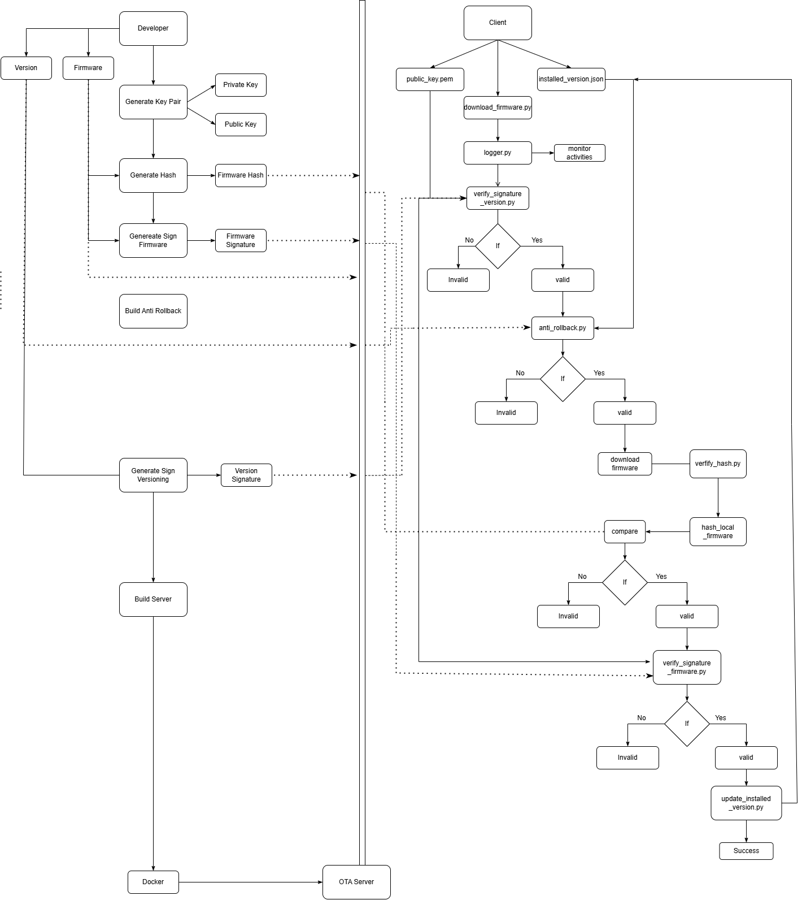
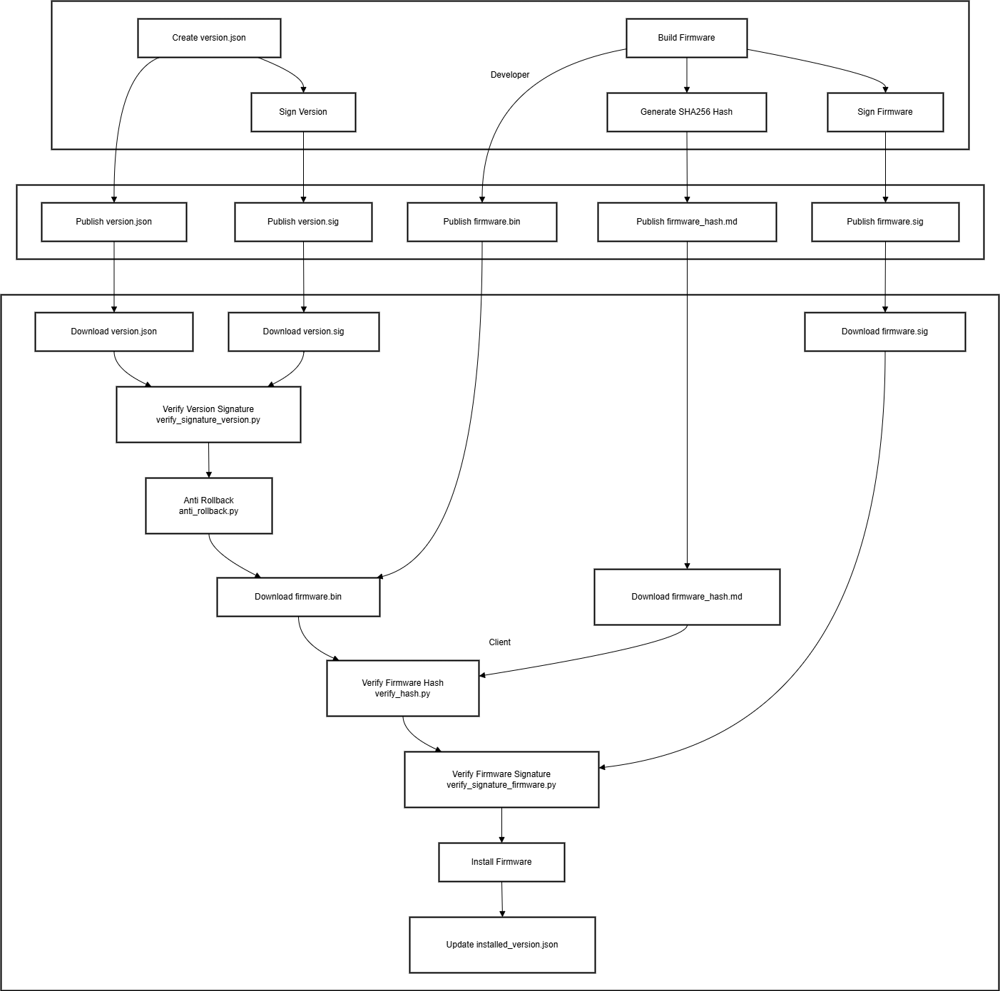

# Secure OTA Firmware Update & Code Signing Infrastructure

A security-focused OTA (Over-The-Air) firmware update system designed to ensure firmware authenticity, integrity, and version consistency through cryptographic verification and rollback protection.

---

# Project Overview

Secure OTA Firmware Update & Code Signing Infrastructure is a security-focused project designed to protect the firmware update process from unauthorized modification, downgrade attacks, replay attacks, and malicious firmware distribution.

The project implements multiple security mechanisms including:

- SHA-256 Firmware Hash Verification
- ECDSA Digital Signature Verification
- Semantic Versioning
- Firmware Version Validation
- Anti Rollback Protection
- Activity Logging
- Secure OTA File Distribution

The primary objective is ensuring that only authentic, untampered, and newer firmware versions can be installed on client devices.

---

# Features

- Firmware Integrity Verification (SHA-256)
- Digital Signature Verification (ECDSA)
- Secure OTA Firmware Distribution
- Firmware Version Management (Semantic Versioning)
- Version Signature Verification
- Anti Rollback Protection
- Activity Logging
- Flask OTA Server
- Docker Deployment
- Secure Client Validation Pipeline

---

# Project Structure

```text
secure-ota-firmware/

├── docs/
│   ├── week1/
│   ├── week2/
│   ├── week3/
│   └── week4/
│
├── firmware/
│   ├── firmware.bin
│   └── version.json
│
├── keys/
│   ├── private_key.pem
│   └── public_key.pem
│
├── output/
│   ├── firmware_hash.md
│   ├── firmware.sig
│   └── version.sig
│
├── scripts/
│   ├── Dev/
│   └── Client/
│
├── Dockerfile
├── requirements.txt
├── README.md
└── Threat_Model.md
```

---

# Security Architecture

The system consists of three primary components.

## Developer

Responsible for preparing secure firmware packages.

- Generate Key Pair
- Generate Firmware
- Generate Firmware Hash
- Generate Firmware Signature
- Generate version.json
- Generate version.sig

↓

## OTA Server

Responsible for distributing update packages.

Published files:

- firmware.bin
- firmware_hash.md
- firmware.sig
- version.json
- version.sig

↓

## Client

Responsible for validating every downloaded file before installation.

Validation Pipeline:

```
Download version.json
        │
        ▼
Download version.sig
        │
        ▼
Verify Version Signature
        │
        ▼
Anti Rollback Protection
        │
        ▼
Download firmware.bin
        │
        ▼
Download firmware_hash.md
        │
        ▼
Verify Firmware Hash
        │
        ▼
Download firmware.sig
        │
        ▼
Verify Firmware Signature
        │
        ▼
Install Firmware
        │
        ▼
Update installed_version.json
        │
        ▼
Firmware Installed Successfully
```

---

# OTA Update Workflow

```
Developer

↓

Generate Firmware

↓

Generate SHA256 Hash

↓

Generate Firmware Signature

↓

Generate version.json

↓

Generate version.sig

↓

Publish to OTA Server

↓

Client Downloads version.json

↓

Verify Version Signature

↓

Anti Rollback Protection

↓

Download firmware.bin

↓

Download firmware_hash.md

↓

Verify Firmware Hash

↓

Download firmware.sig

↓

Verify Firmware Signature

↓

Install Firmware

↓

Update installed_version.json

↓

Firmware Installed Successfully
```

---

# Technologies Used

- Python
- Flask
- Docker
- Cryptography Library
- SHA-256
- ECDSA
- Requests
- JSON
- Logging
- GitHub Actions

---

# Installation

## Clone Repository

```bash
git clone https://github.com/your-repository.git
```

## Install Dependencies

```bash
pip install -r requirements.txt
```

---

## Run OTA Server

```bash
python server.py
```

---

## Run Client

```bash
python download_firmware.py
```

---

# Usage

## Developer Workflow

Generate Key Pair

```
generate_keys.py
```

Generate Firmware Hash

```
generate_hash.py
```

Generate Firmware Signature

```
sign_firmware.py
```

Create Firmware Version

```
version.json
```

Generate Version Signature

```
sign_version.py
```

Run OTA Server

```
server.py
```

---

## Client Workflow

Execute

```
download_firmware.py
```

The client automatically performs:

1. Download version.json
2. Download version.sig
3. Verify Version Signature
4. Anti Rollback Validation
5. Download firmware.bin
6. Download firmware_hash.md
7. Verify Firmware Hash
8. Download firmware.sig
9. Verify Firmware Signature
10. Install Firmware
11. Update installed_version.json

---

# Security Architecture

<p align="center">
    
</p>

And Another

<p align="center">
    
</p>

The Secure OTA Firmware Update system consists of three major components:

- Developer
- OTA Server
- Client

# Security Features

| Security Mechanism      | Description                                    |
| ----------------------- | ---------------------------------------------- |
| SHA-256                 | Verifies firmware integrity                    |
| ECDSA Digital Signature | Verifies firmware authenticity                 |
| Semantic Versioning     | Manages firmware versions                      |
| Version Signature       | Protects version information from modification |
| Anti Rollback           | Prevents firmware downgrade attacks            |
| Activity Logging        | Records every OTA update activity              |

---

# Threat Model

The Secure OTA Firmware Update system is designed to mitigate multiple security threats throughout the firmware distribution process.

The implemented security controls address:

- Firmware Tampering
- Rollback Attack
- Replay Attack
- Key Theft

Each threat includes:

- Risk Analysis
- Impact
- Affected Components
- Mitigation Strategy

See:

```
Threat_Model.md
```

for detailed documentation.

---

# Development Timeline

## Bootcamp Preparation

| Date          | Activity          |
| ------------- | ----------------- |
| June 06, 2026 | On Boarding       |
| June 07, 2026 | Division of Tasks |

---

# Week 1 (June 08 – June 13)

| Date    | Activity                                 | Commit                                                     |
| ------- | ---------------------------------------- | ---------------------------------------------------------- |
| June 08 | Day 1 - Fundamental Cryptography         | docs: add cryptography fundamentals notes                  |
| June 09 | Day 2 - Hashing & SHA256                 | feat: add sha256 hashing script                            |
| June 10 | Day 3 - Cryptography Library             | feat: implement ecdsa key generation                       |
| June 11 | Day 4 - Firmware Simulation              | feat: add dummy firmware and hash generation               |
| June 12 | Day 5 - Digital Signing                  | feat: implement firmware signing process                   |
| June 13 | Day 6 & 7 - Verification & Documentation | feat: add signature verification testing and documentation |

---

# Week 2 (June 14 – June 20)

| Date    | Activity                            | Commit                           |
| ------- | ----------------------------------- | -------------------------------- |
| June 14 | Day 8 - Git Workflow                | docs: github workflow notes      |
| June 15 | Day 9 - GitHub Actions              | docs: github actions notes       |
| June 16 | Day 10 - Build GitHub Actions       | feat: add first github action    |
| June 17 | Day 11 - GitHub Secrets             | feat: configure github secrets   |
| June 18 | Day 12 - GitHub Actions Integration | feat: automate firmware signing  |
| June 19 | Day 13 & 14 - Docker OTA Server     | test: validate automated signing |

---

# Week 3 (June 21 – June 27)

| Date    | Activity                                 | Commit                               |
| ------- | ---------------------------------------- | ------------------------------------ |
| June 21 | Day 15 - OTA Server                      | docs: ota update notes               |
| June 22 | Day 16 - Client Downloader               | feat: add firmware download script   |
| June 23 | Day 17 - Logging System                  | feat: add verification logging       |
| June 24 | Day 18 - Firmware Hash Verification      | feat: add firmware hash verification |
| June 25 | Day 19 - Firmware Signature Verification | feat: add signature verification     |
| June 26 | Day 20 & 21 - Client Testing             | test: verification scenarios         |

---

# Week 4 (June 28 – July 04)

| Date    | Activity                               | Commit                               |
| ------- | -------------------------------------- | ------------------------------------ |
| June 28 | Day 22 - Semantic Versioning           | docs: semantic versioning notes      |
| June 29 | Day 23 - Firmware Versioning           | feat: add firmware versioning        |
| June 30 | Day 24 - Anti Rollback Research        | docs: anti rollback research         |
| July 01 | Day 25 - Rollback Protection           | feat: implement rollback protection  |
| July 02 | Day 26 - Threat Modeling               | docs: add threat model               |
| July 03 | Day 27 - Security Architecture Diagram | docs: add architecture diagram       |
| July 04 | Day 28 - Final Documentation           | docs: complete project documentation |

---

# Testing

## Successful OTA Update

```text
Version Signature VALID

Rollback Check PASSED

Firmware Hash VALID

Firmware Signature VALID

Firmware Ready To Install
```

---

## Rollback Attack

```text
Rollback Detected

Update Rejected
```

---

## Invalid Signature

```text
Signature INVALID

Installation Aborted
```

---

# Project Deliverables

- firmware.bin
- firmware_hash.md
- firmware.sig
- version.json
- version.sig
- installed_version.json
- Threat_Model.md
- Architecture.png
- README.md

---

# Future Improvements

- TLS-secured OTA Communication
- Secure Boot Integration
- Certificate-based Device Authentication
- Hardware Security Module (HSM)
- Delta OTA Update
- Automatic Firmware Recovery
- Firmware Encryption
- CI/CD OTA Deployment Pipeline

---

# Contributors

| Member   | Responsibility                                                           |
| -------- | ------------------------------------------------------------------------ |
| Member 1 | OTA Server                                                               |
| Member 2 | Client Download & Logging                                                |
| Member 3 | Cryptography                                                             |
| Member 4 | Versioning, Anti Rollback, Threat Modeling, Documentation & Architecture |

---

# License

This project is developed for educational purposes as part of the Logistics & IoT Edge Bootcamp.

Copyright © 2026.
